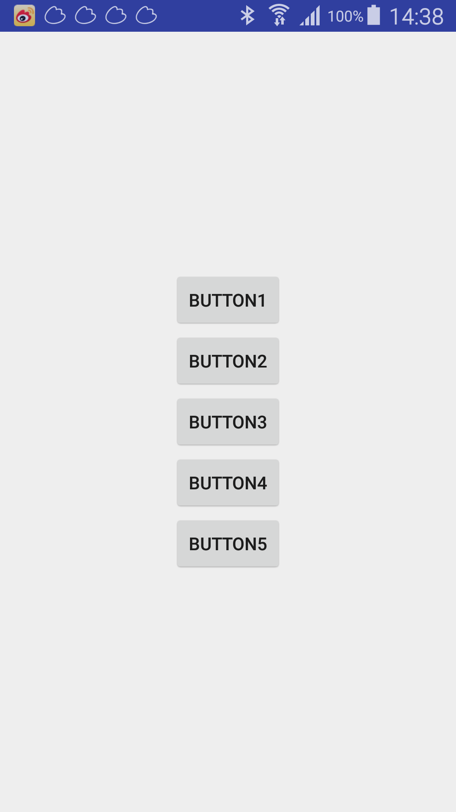
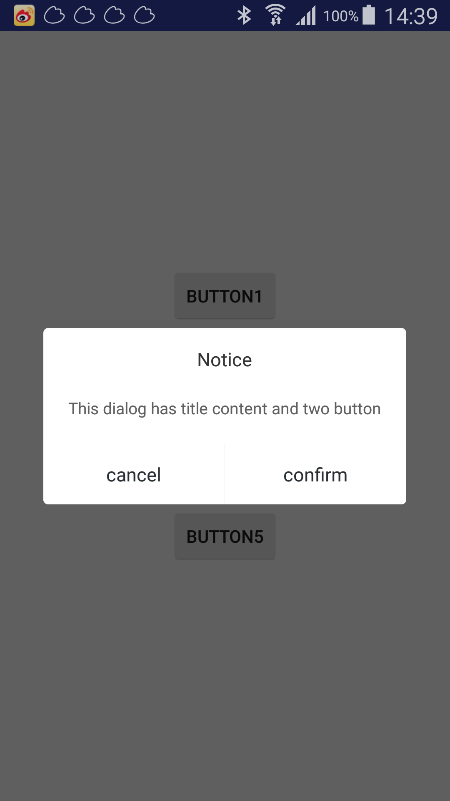
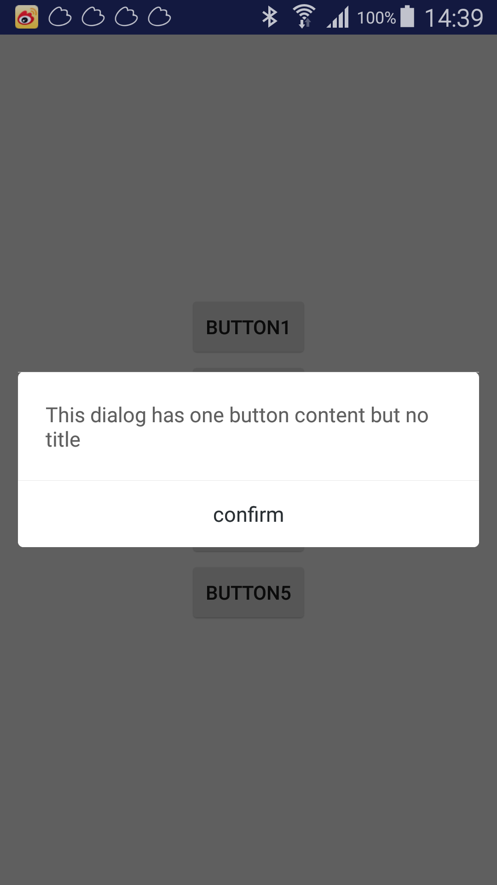

# CommonDialog
This prohect is provider for android dialog

## Screenshot
  
  
  

## Including In Your Project
compile 'com.terry:tcdialoglibrary:1.0'

## Usage

``` java

	TCDialogUtils.showTipDialog(mContext, "Notice", "This dialog has title content and two button", "cancel", "confirm", new TipDialog.OnDialogBtnClickListener() {
	                    @Override
	                    public void onLeftBtnClicked(TipDialog paramTipDialog) {

	                    }

	                    @Override
	                    public void onRightBtnClicked(TipDialog paramTipDialog) {

	                    }
	                });
	
	TCDialogUtils.showTipDialogNoTitle(mContext, "This dialog has content and two button but no title", "cancel", "confirm", new TipDialog.OnDialogBtnClickListener() {
	                    @Override
	                    public void onLeftBtnClicked(TipDialog paramTipDialog) {

	                    }

	                    @Override
	                    public void onRightBtnClicked(TipDialog paramTipDialog) {

	                    }
	                });				
					
	TCDialogUtils.showTipDialogOneButton(mContext, "title", "This dialog has one button title and content", "confirm", new TipDialogOneButton.OnConfirmListener() {
	                    @Override
	                    public void onConfirm(Dialog paramDialog) {

	                    }
	                });
					
					
	TCDialogUtils.showTipDialogOneButtonNoTitle(mContext, "This dialog has one button content but no title", "confirm", new TipDialogOneButton.OnConfirmListener() {
	                    @Override
	                    public void onConfirm(Dialog paramDialog) {

	                    }
	                });

```


**About me**  
Weixin: kkxl003   
Email: 12013001@qq.com

